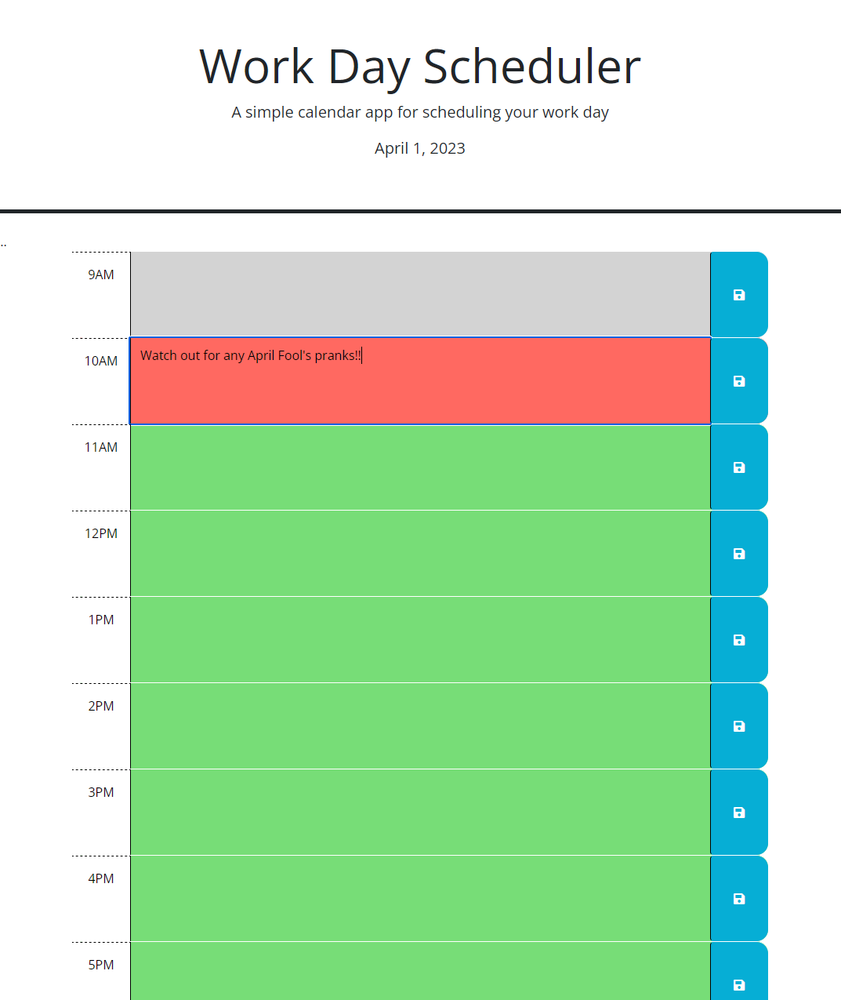

# Work-Day-Scheduler

## Description
This is a work day scheduler on your browser. It has different color blocks to indicate past, present, or future, and in each block you can write and save events that you need to remember. Below is a preview to the page as as well as a link to the webpage.
## Table of Contents
- [Description](#description)
- [Preview](#preview)
- [Author](#author)
- [License](#license)

## Preview
Link to website: [CLICK ME](https://jo3kr.github.io/Work-Day-Scheduler/)

## Author
Joel John
- [GitHub](https://github.com/jo3kr)
## License
 MIT License

Copyright &copy; 2022 jo3kr &#127183;